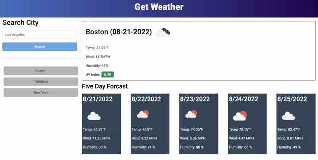

# Get Weather

[Get Weather](https://guitarkeegan.github.io/get-weather/)

## Description

Use this app to get the current weather, as well as the five-day-forcast to a given city, using the Open Weather API. The front-end was built with HTML, CSS, JavaScript/jQuery.

In order to practice my ability to replicate the styling of another site without access to the code, I did my best to copy the styling and color themes of the example site below.

## Authors

Keegan Anglim 
[@NageekDBeat](https://twitter.com/nageekdbeat)

## License

This project is licensed under the MIT License - see the LICENSE.md file for details

## Preview

## Example Site

## My Site
